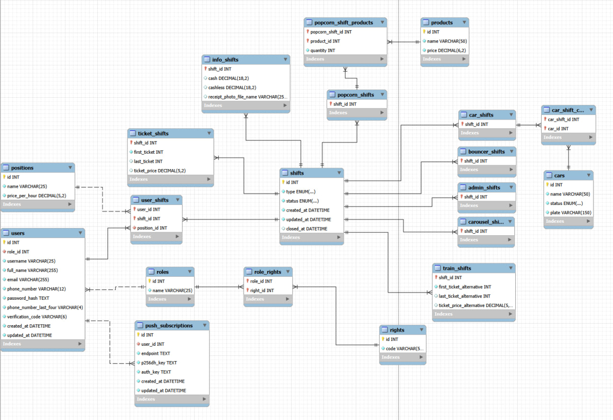

# Документация базы данных

## Содержание

### [1. О системе](#о-системе)

### [2. Схема БД](#схема-бд)

### [3. Основные сущности БД](#основные-сущности-бд)
- [3.1. users](#users) — Учетные записи сотрудников.
- [3.2. push\_subscriptions](#push_subscriptions) — Подписки на уведомления.
- [3.3. positions](#positions) — Справочник должностей.

### [4. Сущности смен](#сущности-смен)
- [4.1. shifts](#shifts) — Ядро системы (родительская смена).
- [4.2. info\_shifts](#info_shifts) — Финансовая часть смены (деньги, чек).
- [4.3. ticket\_shifts](#ticket_shifts) — Билетная часть смены (нумерация).
- [4.4. Виды смен](#виды-смен) — Маркерные таблицы под каждый тип аттракциона.
- [4.5. Дополнительные сущности смен](#дополнительные-сущности-смен) — Справочники товаров и машин.

### [5. Сущности разделения прав доступа](#сущности-разделения-прав-доступа)
- [5.1. roles](#roles) — Роли пользователей.
- [5.2. rights](#rights) — Права доступа.

### [6. Смежные таблицы](#смежные-таблицы)
- [6.1. role\_rights](#role_rights) — Связь ролей и прав.
- [6.2. car\_shifts\_cars](#car_shifts_cars) — Какие машины были на смене.
- [6.3. popcorn\_shift\_products](#popcorn_shift_products) — Продажи товаров на смене попкорна.
- [6.4. user\_shifts](#user_shifts) — Кто и кем работал на смене.

### [6. Бизнес-логика сущностей](#бизнес-логика-сущностей)
- [6.1. Описание связей](#бизнес-логика-сущностей) — ER-логика системы.

## О системе

Данная база данных предназначена для автоматизации учёта работы аттракционов и административных смен.

**Ключевые возможности:**
- Учёт сотрудников, их ролей и прав доступа.
- Открытие и закрытие смен по типам аттракционов.
- Раздельный учёт финансов и билетов.
- Фиксация использованных машин и проданных товаров.
- Назначение сотрудников на смены с указанием должности.

**Архитектурное решение:**  
Родительская таблица `shifts` содержит общие поля для всех типов смен (даты, статус, тип). Для каждого типа создана отдельная таблица-маркер (`car_shifts`, `train_shifts` и т.д.), что позволяет гибко расширять систему и минимизировать фильтрацию данных через `WHERE type = ...` в часто выполняемых запросах.

## Схема БД

## Основные сущности БД

### users

Таблица предназначена для хранения учётных записей пользователей системы. Она объединяет аутентификационные данные (логин, хеш пароля, верификационный код), контактную информацию (email, телефон) и служебные метки времени для аудита.

| Поле                      | Тип данных   | Размер | Обязательность | Индекс                | Примечаниие           |
|---------------------------|--------------|--------|----------------|-----------------------|-----------------------|
| id                        | INT          | -      | NOT NULL       | PRIMARY KEY           | AUTOINCREMENT         |
| role_id                   | INT          | -      | NOT NULL       | FOREIGN KEY           | REFERENCE roles(id)   |
| username                  | VARCHAR      | 25     | NOT NULL       | +                     | UNIQUE                |
| full_name                 | VARCHAR      | 255    | NOT NULL       | +                     |                       |
| email                     | VARCHAR      | 255    | NOT NULL       | +                     | UNIQUE                |
| phone_number              | VARCHAR      | 12     | NOT NULL       | +                     | UNIQUE                |
| password_hash             | TEXT         | -      | NOT NULL       | -                     |                       |
| phone_number_last_four    | VARCHAR      | 4      | NOT NULL       | +                     |                       |
| verification_code         | VARCHAR      | 6      | NOT NULL       | -                     |                       |
| created_at                | DATETIME     | -      | NOT NULL       | +                     |                       |
| updated_at                | DATETIME     | -      | NOT NULL       | -                     |                       |

### push_subscriptions

Таблица предназначена для хранения подписок на push-уведомления в браузере или мобильных приложениях. Она связывает учётную запись пользователя с устройством или браузером, позволяя отправлять ему уведомления.

| Поле                      | Тип данных   | Размер | Обязательность | Индекс                | Примечаниие           |
|---------------------------|--------------|--------|----------------|-----------------------|-----------------------|
| id                        | INT          | -      | NOT NULL       | PRIMARY KEY           | AUTOINCREMENT         |
| user_id                   | INT          | -      | NOT NULL       | FOREIGN KEY           | REFERENCE users(id)   |
| endpoint                  | TEXT         | -      | NOT NULL       | -                     |                       |
| p256dh_key                | TEXT         | -      | NOT NULL       | -                     |                       |
| auth_key                  | TEXT         | -      | NOT NULL       | -                     |                       |
| created_at                | DATETIME     | -      | NOT NULL       | +                     |                       |
| updated_at                | DATETIME     | -      | NOT NULL       | -                     |                       |

### positions

Таблица предназначена для хранения справочника должностей, которые назначаются сотрудникам смены. 

| Поле                      | Тип данных   | Размер | Обязательность | Индекс                | Примечаниие           |
|---------------------------|--------------|--------|----------------|-----------------------|-----------------------|
| id                        | INT          | -      | NOT NULL       | PRIMARY KEY           | AUTOINCREMENT         |
| name                      | VARCHAR      | 25     | NOT NULL       | +                     | UNIQUE                |
| price_per_hour            | DECIMAL      | 5,2    | NOT NULL       | -                     |                       |

 

## Сущности смен

### shifts

Основная таблица смен, используюшаяся всеми типами смен. Содержит в себе информацию, которой должны обладать все типы смен при открытии и закрытии. Бизнес логика системы гарантирует заполнение NULLABLE полей при закрытии смены. 

| Поле                      | Тип данных   | Размер | Обязательность | Индекс                | Примечаниие           |
|---------------------------|--------------|--------|----------------|-----------------------|-----------------------|
| id                        | INT          | -      | NOT NULL       | PRIMARY KEY           | AUTOINCREMENT         |
| type                      | ENUM         | -      | NOT NULL       | -                     | ENUM ("car", "train", "popcorn", "bouncer", "carousel", "admin") |
| status                    | ENUM         | -      | NOT NULL       | -                     | ENUM ("opened", "closed"), DEFAULT "opened" |
| created_at                | DATETIME     | -      | NOT NULL       | +                     |                       |
| updated_at                | DATETIME     | -      | NOT NULL       | -                     |                       |
| closed_at                 | DATETIME     | -      | NULL           | PARTIAL               | INDEX (status, closed_at) |

### info_shifts

Дополнительная таблица смен, используюшаяся типами смен, которые работают с финансами. Бизнес логика системы гарантирует заполнение NULLABLE полей при закрытии смены. 

| Поле                      | Тип данных   | Размер | Обязательность | Индекс                | Примечаниие           |
|---------------------------|--------------|--------|----------------|-----------------------|-----------------------|
| shift_id                  | INT          | -      | NOT NULL       | PRIMARY KEY           | REFERENCE shifts(id)  |
| cash                      | DECIMAL      | 18,2   | NULL           | -                     |                       |
| cashless                  | DECIMAL      | 18,2   | NULL           | -                     |                       |
| receipt_photo_file_name   | VARCHAR      | 100    | NULL           | -                     |                       |

### ticket_shifts

Дополнительная таблица смен, используюшаяся типами смен, которые работают с билетами. Бизнес логика системы гарантирует заполнение NULLABLE полей при закрытии смены. 

| Поле                      | Тип данных   | Размер | Обязательность | Индекс                | Примечаниие           |
|---------------------------|--------------|--------|----------------|-----------------------|-----------------------|
| shift_id                  | INT          | -      | NOT NULL       | PRIMARY KEY           | REFERENCE shifts(id)  |
| first_ticket              | INT          | -      | NOT NULL       | -                     |                       |
| last_ticket               | INT          | -      | NULL           | -                     |                       |
| ticket_price              | DECIMAL      | 5,2    | NOT NULL       | -                     |                       |

### Виды смен

У разных типов смен — разные наборы полей. Но даже у тех, где структура одинаковая, сознательно были созданы отдельные таблицы. Причина: так проще и быстрее работать с данными. Вместо того чтобы в каждом запросе отсеивать лишние типы через WHERE type = ..., обращение идет сразу к нужной таблице. Это снижает нагрузку на базу и ускоряет выполнение самых частых запросов. Да, это небольшое дублирование, но оно оправдано производительностью и удобством поддержки

### car_shifts, carousel_shifts, bouncer_shifts, popcorn_shifts, admin_shifts

Таблицы использующиеся для типов смен: машины, карусель, батут

| Поле                      | Тип данных   | Размер | Обязательность | Индекс                   | Примечаниие           |
|---------------------------|--------------|--------|----------------|--------------------------|-----------------------|
| shift_id                  | INT          | -      | NOT NULL       | PRIMARY KEY, FOREIGN KEY | REFERENCE shifts(id)  |

### train_shifts

Таблица использующаяся для смен паровоза

| Поле                      | Тип данных   | Размер | Обязательность | Индекс                   | Примечаниие           |
|---------------------------|--------------|--------|----------------|--------------------------|-----------------------|
| shift_id                  | INT          | -      | NOT NULL       | PRIMARY KEY, FOREIGN KEY | REFERENCE shifts(id)  |
| first_ticket_alternative  | INT          | -      | NOT NULL       | -                        |                       |
| last_ticket_alternative   | INT          | -      | NULL           | -                        |                       |
| ticket_price_alternative  | DECIMAL      | 5,2    | NOT NULL       | -                        |                       |

### Дополнительные сущности смен

Некоторые смены могут обладать дополнительными свойствами: на сменах машинок нужно указывать машинки, которые использовались на смене, на сменах попкорна и ваты - количество проданного товара того или иного вида, в связи с этим добавлены дополнительные сущности смен

### cars

Таблица со справочником машин, использующимися на сменах машин.
plate - идентификационный номер контроллера машины.

| Поле                      | Тип данных   | Размер | Обязательность | Индекс                | Примечаниие           |
|---------------------------|--------------|--------|----------------|-----------------------|-----------------------|
| id                        | INT          | -      | NOT NULL       | PRIMARY KEY           |                       |
| name                      | VARCHAR      | 50     | NOT NULL       | +                     | UNIQUE                |
| status                    | ENUM         | -      | NOT NULL       | -                     | ENUM ("working", "broken"), DEFAULT "working" |
| plate                     | VARCHAR      | 150    | NOT NULL       | -                     | DEFAULT "-"           |

### products

Таблица со справочником товаров, которые продаются в сменах попкорна и ваты.

| Поле                      | Тип данных   | Размер | Обязательность | Индекс                | Примечаниие           |
|---------------------------|--------------|--------|----------------|-----------------------|-----------------------|
| id                        | INT          | -      | NOT NULL       | PRIMARY KEY           | AUTOINCREMENT         |
| name                      | VARCHAR      | 50     | NOT NULL       | +                     | UNIQUE                |
| price                     | DECIMAL      | 6,2    | NOT NULL       | -                     |                       |

 

## Сущности разделения прав доступа

### roles

Таблица для ролей пользователей для разделения прав доступа

| Поле                      | Тип данных   | Размер | Обязательность | Индекс                | Примечаниие           |
|---------------------------|--------------|--------|----------------|-----------------------|-----------------------|
| id                        | INT          | -      | NOT NULL       | PRIMARY KEY           | AUTOINCREMENT         |
| name                      | VARCHAR      | 25     | NOT NULL       | +                     | UNIQUE                |

### rights

Таблица для прав, содержащихся у роли

| Поле                      | Тип данных   | Размер | Обязательность | Индекс                | Примечаниие           |
|---------------------------|--------------|--------|----------------|-----------------------|-----------------------|
| id                        | INT          | -      | NOT NULL       | PRIMARY KEY           | AUTOINCREMENT         |
| code                      | VARCHAR      | 50     | NOT NULL       | +                     | UNIQUE                |

 

# Смежные таблицы

### role_rights

Таблица связывающая роли и права M:N

| Поле                      | Тип данных   | Размер | Обязательность | Индекс                   | Примечаниие           |
|---------------------------|--------------|--------|----------------|--------------------------|-----------------------|
| role_id                   | INT          | -      | NOT NULL       | PRIMARY KEY, FOREIGN KEY | REFERENCE roles(id)   |
| right_id                  | INT          | -      | NOT NULL       | PRIMARY KEY, FOREIGN KEY | REFERENCE rights(id)  |

### car_shifts_cars

Таблица связывающая смены машин и машины M:N

| Поле                      | Тип данных   | Размер | Обязательность | Индекс                   | Примечаниие              |
|---------------------------|--------------|--------|----------------|--------------------------|--------------------------|
| car_shift_id              | INT          | -      | NOT NULL       | PRIMARY KEY, FOREIGN KEY | REFERENCE car_shifts(id) |
| car_id                    | INT          | -      | NOT NULL       | PRIMARY KEY, FOREIGN KEY | REFERENCE cars(id)       |

### popcorn_shift_products

Таблица связывающая смены попкорна и ваты и товары M:N, дополнительно включающая количество товара

| Поле                      | Тип данных   | Размер | Обязательность | Индекс                   | Примечаниие                  |
|---------------------------|--------------|--------|----------------|--------------------------|------------------------------|
| popcorn_shift_id          | INT          | -      | NOT NULL       | PRIMARY KEY, FOREIGN KEY | REFERENCE popcorn_shifts(id) |
| product_id                | INT          | -      | NOT NULL       | PRIMARY KEY, FOREIGN KEY | REFERENCE products(id)       |
| quantity                  | INT          | -      | NOT NULL       |                          | DEFAULT 0                    |

### user_shifts

Таблица связывающая пользователей и смены M:N, дополнительно включающая должность сотрудника на смене

| Поле                      | Тип данных   | Размер | Обязательность | Индекс                   | Примечаниие                  |
|---------------------------|--------------|--------|----------------|--------------------------|------------------------------|
| user_id                   | INT          | -      | NOT NULL       | PRIMARY KEY, FOREIGN KEY | REFERENCE users(id)          |
| shift_id                  | INT          | -      | NOT NULL       | PRIMARY KEY, FOREIGN KEY | REFERENCE shifts(id)         |
| position_id               | INT          | -      | NOT NULL       | FOREIGN KEY              | REFERENCE positions(id)      |

# Бизнес логика сущностей

Бизнес логика сущностей контролируется бизнес логикой системы API.

Пользователь:
- имеет одну роль;
- имеет множество смен.
  
Роль:
- имеет множество прав.
  
Право:
- имеет множество ролей.
  
Родительская смена:
- имеет одну типовую смену;
- имеет одну информационную смену, если того требует тип смены;
- имеет одну билетовую смену, если того требует тип смены.

Информационная смена:
- имеет одну родительскую смену.

Билетовая смена:
- имеет одну родительскую смену.

Смена машин:
- имеет одну родительскую смену;
- требует создание информационной смены;
- требует создание билетовой смены;
- имеет множество машин.

Смена попокорна:
- имеет одну родительскую смену;
- требует создание информационной смены;
- имеет множество товаров.
  
Смена батута:
- имеет одну родительскую смену;
- требует создание информационной смены;
- требует создание билетовой смены.

Смена паровоза:
- имеет одну родительскую смену;
- требует создание информационной смены;
- требует создание билетовой смены.
  
Смена карусели:
- имеет одну родительскую смену;
- требует создание информационной смены;
- требует создание билетовой смены.

Смена администратора:
- имеет одну родительскую смену.
